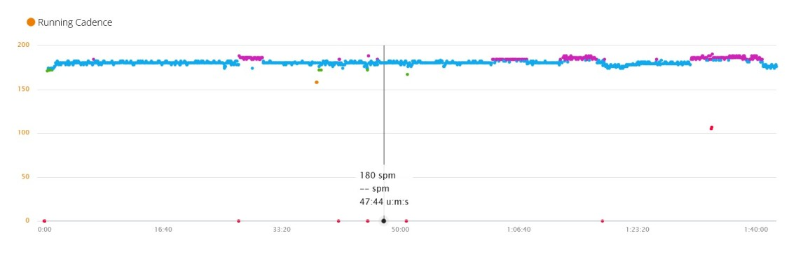

# Spotify Running Playlist maker

##### Create playlists of tracks with a given tempo and genre.


## The Problem: Spotify has the songs... but no way to find them. 

_Maybe_ you are a bit like me, an avid runner and a music lover. 
On my runs, I get tired of listening to the same few tracks over and over again. 
Spotify has more music than you can imagine, so I want some variation, in fact, A LOT of variation. 
At the same time, the music should still be tuned to my running pace.



_This is what I use it for: this graph (from [Garmin Connect](https://connect.garmin.com)) plots cadence over a running workout run with a playlist of just the right BPM._

But how do you find the right BPM?
- Spotify's suggestions nor the user interface let you really poke around for music with the right tempo, in the genre you like. 
(Around 2015-2018 the _Spotify Running_ feature kinda did the job; and then [they pulled the plug on it](https://community.spotify.com/t5/Content-Questions/Retirement-of-our-Running-Feature/td-p/4383603).)
- Sure, you can always get _someone else_'s public running playlist, but [are their tastes as bad as your own](https://pudding.cool/2021/10/judge-my-music/)? Is the BPM range just right? For me, that's just not an option. 
- To interactively explore genres, [EveryNoise](https://everynoise.com) has done a tremendous job, but you cannot create playlists with it, let alone filter the BPM. 
- For filtering music on tempo, you _can_ use awesome tools like what [Playlist Machinery](http://sortyourmusic.playlistmachinery.com) have on offer. 
  But its main drawback is, it only works on your existing playlists, in other words _on the music you have already found_.  


_Maybe_ you are not like me at all. Could be you just want to scour Spotify for that next great song that would
blend nicely into that DJ-set you already have. A selection on genre and tempo is what you want. 
Or perhaps you have some other use for this crawler-filter.  

## The Solution: the Spotify Running Playlist maker

This python program, **the Spotify Running Playlist maker** will let you access all songs Spotify has available within a given genre, 
and save the songs that match your (tempo) filter to your spotify user profile (free or premium) in one or several new playlists.

The functional flow is as follows: 
1. You configure all your settings in the [settings.toml](settings.toml) file and run the program.  
2. It searches Spotify for all artists corresponding to the given genre
3. It then loops over these artists, and retrieves all albums of each artist
4. It gets the tracks of each album and fetches their tempo
5. It retains only tracks within desired tempo range, discards the other tracks
6. If the search was successful, it saves these tracks to one or more new playlist(s),
and this only if they did not already appear in one or more other playlists you might have.

Because Spotify has a HUGE library, chances are real that you will find a lot of tracks even with the strictest of search settings.
If you save thousands of tracks to a single playlist, this can get unwieldy to work with quickly. 
This is why there is an option to save in several parts. 

## Setup

1. Download this repository. 
2. Create yourself an "app" on https://developers.spotify.com/.
This app will let the python code technically connect to your spotify account by providing you with two codes: the _CLIENT ID_ and _CLIENT SECRET_.
3. Save these values to your [settings.toml](settings.toml) file.
4. Configure the rest of the [settings.toml](settings.toml) settings so that it trawls through the right Spotify waters with the kind of fishing net you want.
5. Install dependencies: 
```shell
pip install spotipy
pip install tomli
```


## How to execute

Before you can run, you **must** configure all your settings in the [settings.toml](settings.toml) file.
Each setting's purpose is documented inside the file itself. 

The program itself takes no runtime arguments, so once you saved your settings, you just run this command from the directory where main.py is located:
```shell
python main.py
```
The first time, a browser window will open in which Spotify will request you to authorize the code; please grant this privilege. 
I prefer to run this from inside [PyCharm](https://www.jetbrains.com/pycharm/download), but you can just run from a command shell instead. (Only tested on Windows.) 


Once the program has done its job, enjoy your new playlists in your favourite Spotify client! 
They are just regular playlists, which you can subsequently modify, delete, collaborate on, ...


A generated playlist will have a name containing 
   - the genre you selected
   - the tempo range you selected
   - the date when you run the program
   - and a "Part XX" identifier in case you opted to assign a max number of tracks to any one given playlist (and more playlists were needed to save all the search results).  

## Technical
This is python code that leverages the excellent [Spotipy](https://spotipy.readthedocs.io) library which provides a
convenient wrapper for accessing [Spotify's Web API](https://developer.spotify.com/documentation/web-api/reference/#/).
The retrieved data is temporarily stored in an in-memory database (sqlite3) which makes things like sorting and comparing a lot easier. 

I am not a professional programmer and still quite new to python so be gentle with me. 

## Known limitations
### - I still get duplicates though I have tried to filter them out.
The very same tracks may exist on Spotify with a different track URI, making them unique. 
We try to work around this by also comparing the track name and eliminating on this basis; 
but then still there may be small differences for example in case or punctuation causing the names to be interpreted as different.

### - No tracks are found for some artists
We pass through the ["get artist's albums"](https://developer.spotify.com/documentation/web-api/reference/#/operations/get-an-artists-albums) 
end point of the spotify API to know what music an artist has released;
sometimes artists just _appear on_ other artists' albums and this API end point does not return that information.

### - I expected this artist; and they do not show up at all
The actual genre the artist is tagged with might be different from the one you are searching. 
A quick and simple litmus test for this is trying to use the "find artist" search box on [EveryNoise](https://everynoise.com). 
Either it will list the genres the artist appears in; or it will politely reply "_Sorry, that one doesn't seem to be on any of these maps yet._" 
This is because some artists are simply not tagged with any genre at all. This makes them essentially undiscoverable with this tool.

## Reporting Issues

If you have suggestions, bugs or other issues specific to this playlist generator,
file them [here](https://github.com/JohanVanHoye/spotify-running-playlist-maker/issues).
Or just send a pull request.

Thanks for giving it a try and have fun with your new running playlists :-). 