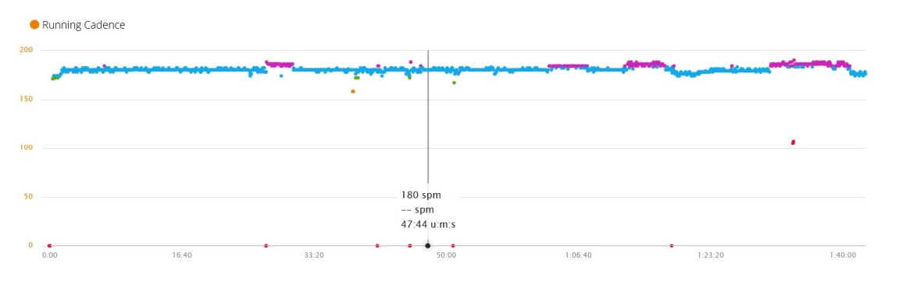

# Spotify Running Playlist Maker

##### Create playlists of tracks with a given tempo and genre.


## The Problem: Spotify has the songs... but keeps removing the tools to find them.

_Maybe_ you are a bit like me, an avid runner and a music lover.
On my runs, I get tired of listening to the same few tracks over and over again.
Spotify has more music than you can imagine, so I want some variation — in fact, A LOT of variation.
At the same time, the music should still be tuned to my running pace.



_This is what I use it for: this graph (from [Garmin Connect](https://connect.garmin.com)) plots cadence over a running workout run with a playlist of just the right BPM._

But how do you find the right music?
- Spotify's interface gives you no way to browse by tempo or genre with any real precision.
  (Around 2015–2018 the _Spotify Running_ feature kinda did the job; and then [they pulled the plug on it](https://community.spotify.com/t5/Content-Questions/Retirement-of-our-Running-Feature/td-p/4383603).)
- Sure, you can always grab _someone else_'s public running playlist, but [are their tastes as bad as your own](https://pudding.cool/2021/10/judge-my-music/)? Is the BPM range just right? For me, that's just not an option.
- [EveryNoise](https://everynoise.com) did a tremendous job mapping genres, but it is now frozen in time as of December 2023, sabotaged by the Spotify layoffs that ended its development.
- For filtering music on tempo, tools like [Playlist Machinery](http://sortyourmusic.playlistmachinery.com) are great — but they only work on playlists you already have, meaning _music you have already found_.
- Spotify's own developer API, which this tool originally relied on for both genre-based artist search and tempo (BPM) data, had key endpoints removed in November 2024.

_Maybe_ you are not like me at all. Perhaps you just want to scour Spotify for the next great track to blend into a DJ set. Or you have some other use for a genre-and-tempo crawler. Either way, read on.


## The Solution: the Spotify Running Playlist Maker

This Python program will discover artists and tracks on Spotify within a given genre, measure their tempo, and save the songs that match your tempo filter to your Spotify profile as one or more new playlists.

### The solution worked great, until it didn't anymore. 
In fact, it broke beyond repair, or so I thought. 
What changed since the original version: 

Spotify removed two critical API features for third-party apps in November 2024:

| Feature | Old approach | New approach |
|---------|-------------|--------------|
| **Genre → artist discovery** | Spotify `search(type=artist, genre:...)` | [Last.fm](https://www.last.fm/api) tag-based search — free, crowd-sourced, continuously updated |
| **BPM / tempo per track** | Spotify Audio Features API | [Deezer](https://developers.deezer.com/api) 30-second preview clips + [librosa](https://librosa.org) local beat analysis |

[EveryNoise](https://everynoise.com) is also no longer used as a genre reference — it has been frozen since December 2023 and does not reflect new music or evolving scenes.

However, Claude Code to the rescue! A new approach works around the critical APIs from other sources. 


## How it works

The functional flow is as follows:

1. You configure all your settings in [settings.toml](settings.toml) and run the program.
2. **Genre → artist discovery (via Last.fm):**
   - Fetches the top artists for your chosen genre tag across multiple pages of Last.fm results (configurable depth). Earlier pages surface the well-known names; later pages reach the long-tail artists.
   - Expands the pool further via a similarity graph: the top results are used as seeds for Last.fm's `artist.getSimilar` endpoint, which surfaces genre-authentic artists regardless of popularity. You can also add your own seed artists in settings.
   - All discovered artist names are resolved to Spotify artist IDs via name search.
3. **Album and track enumeration (via Spotify):** for each artist, all albums and singles are fetched, then all tracks within them.
4. **BPM measurement (via Deezer + librosa):**
   - The app searches Deezer's public API for each track to obtain a 30-second preview MP3.
   - The clip is downloaded temporarily and analysed locally by librosa's beat tracker.
   - The temp file is deleted immediately after analysis.
   - Results are cached in a local `bpm_cache.db` file so tracks are never downloaded and analysed twice across runs.
5. **Filtering:** only tracks whose BPM falls within your configured range are kept. Optionally, tracks at double or half the target BPM are also included (useful for tracks where the beat tracker locks onto a different subdivision).
6. **Playlist creation:** matching tracks are saved to one or more new Spotify playlists. Tracks already present in your existing playlists can be excluded — either by name, or wholesale with `["*"]`.


## Setup

### 1. Create a Spotify app

Go to [developer.spotify.com/dashboard](https://developer.spotify.com/dashboard) and create an app.
This gives you a **Client ID** and **Client Secret**.

In your app settings, add the following Redirect URI:
```
http://127.0.0.1:8888/callback
```

### 2. Get a Last.fm API key

Register at [last.fm/api/account/create](https://www.last.fm/api/account/create) to get a free API key.
No review process — it is issued immediately.

### 3. Configure settings.toml

Copy your Spotify Client ID, Client Secret, and Last.fm API key into [settings.toml](settings.toml).
Each setting is documented inside the file.

### 4. Set up a virtual environment and install dependencies

```shell
python -m venv .venv
.venv\Scripts\pip install -r requirements.txt   # Windows
# or
.venv/bin/pip install -r requirements.txt       # macOS / Linux
```

Key dependencies: `spotipy`, `librosa`, `requests`, `tomli`.


## How to run

```shell
.venv\Scripts\python main.py   # Windows
# or
.venv/bin/python main.py       # macOS / Linux
```

**First run only:** a browser window will open asking you to authorise the app with your Spotify account. After authorising, the browser will redirect to a localhost address that shows "This site can't be reached" — that is expected. Copy the full URL from the address bar and paste it into the terminal. The authorisation token is then cached locally and this step does not repeat.

Once the program completes, your new playlists appear in your Spotify account as regular playlists — you can modify, delete, download, or collaborate on them like any other.

Generated playlist names include:
- The genre tag you searched
- The tempo range
- The date the program was run
- A "Part XX" suffix if you set a maximum number of tracks per playlist and multiple playlists were needed


## Settings reference

| Setting | Description |
|---------|-------------|
| `genre_searchstring` | The Last.fm genre tag to search, e.g. `darkwave`, `coldwave`, `ebm` |
| `artist_searchstring` | Optional narrowing filter on artist name |
| `interactive_mode` | If `true`, prompts you to approve each artist before scanning |
| `bpm_floor` / `bpm_ceiling` | Tempo range in BPM |
| `allow_doubled_bpm` | Also include tracks at 2× or ½× the target BPM (handles beat tracker octave errors) |
| `playlists_to_exclude` | Playlist names to exclude tracks from. Use `["*"]` to exclude all existing playlists — only brand new tracks will be added |
| `max_tracks_per_playlist` | Maximum tracks per playlist (0 = unlimited) |
| `max_tracks_to_save` | Maximum tracks across all playlists (0 = unlimited) |
| `lastfm.api_key` | Your Last.fm API key |
| `lastfm.tag_pages` | How many pages of top artists to fetch per tag (50 per page). Higher = more long-tail artists |
| `lastfm.seed_artists` | Optional list of artists to use as additional seeds for the similarity graph |
| `debug` | Set to `true` for verbose output including out-of-range BPM values |


## Technical notes

- Genre discovery uses [Last.fm's tag API](https://www.last.fm/api/show/tag.getTopArtists) with configurable pagination depth, combined with [artist similarity](https://www.last.fm/api/show/artist.getSimilar) graph traversal to surface long-tail artists.
- BPM analysis runs entirely on your machine using [librosa](https://librosa.org). Audio is sourced from [Deezer's public preview API](https://developers.deezer.com/api) (no API key required). Preview clips are 30 seconds at 128 kbps (~480 KB each) and are deleted immediately after analysis.
- BPM results are cached in `bpm_cache.db` (SQLite) to avoid re-downloading and re-analysing the same tracks on subsequent runs.
- Per-run deduplication and playlist tracking use a separate in-memory SQLite database.
- The Spotify OAuth token is cached in a `.cache` file after first authorisation.


## Known limitations

### Duplicate tracks
The same recording may exist on Spotify under different URIs. The app deduplicates by track name as a best effort, but minor differences in capitalisation or punctuation can cause the same song to appear twice.

### Artists that appear on other artists' albums
The Spotify [`get-an-artists-albums`](https://developer.spotify.com/documentation/web-api/reference/#/operations/get-an-artists-albums) endpoint only returns albums where the artist is the primary credited artist. Guest appearances on other people's albums are not captured.

### Artists not found at all
If an artist has no genre tags on Last.fm, they will not appear in tag-based discovery. You can still reach them directly by leaving `genre_searchstring` as a broad tag or space and specifying the artist name in `artist_searchstring`.

### BPM accuracy
Librosa analyses a 30-second preview clip, which may start at an intro, outro, or quiet passage not representative of the track's main groove. The `allow_doubled_bpm` setting catches the most common error (beat tracker locking onto half-time or double-time). Tracks with genuinely ambiguous or variable tempo may be measured incorrectly.

### Tracks with no Deezer preview
A small number of tracks have no 30-second preview available on Deezer. These are skipped and logged. BPM analysis is not possible for them without an alternative audio source.


## Reporting issues

File bugs or suggestions [here](https://github.com/JohanVanHoye/spotify-running-playlist-maker/issues), or send a pull request.

Thanks for giving it a try — enjoy your new running playlists.
